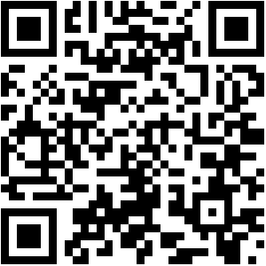
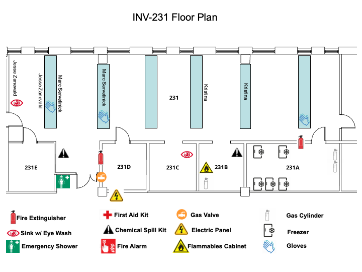

# Zaneveld Lab Safety

Laboratory Lab Safety site with Lab Safety Information, Templates, and Issues for UWBB-273

## Key Links

[University of Washington Environmental Health and Safety Webpage](https://www.ehs.washington.edu/research-lab/laboratory-safety)

[Lab Safety Manual](https://ehs.washington.edu/system/files/resources/lsm.pdf)

[Safety Dashboard](https://labsurvey.ehs.washington.edu/pi/dashboard.php?IDlab=184&PI=Zaneveld&labID=ZANEVELD-184-1146)

[MyChem Inventory for the Lab](https://mychem.ehs.washington.edu/Inventory/InventoryList?roomOwnerID=10873&page=1)

All [Material Safety Data Sheets](./MSDS/) (MSDS) for the lab. 

Lab Organization Spreadsheet:[link](https://docs.google.com/spreadsheets/d/19f-il2Yy4KuWmRdwzCkEdx-e10qrQugKBTrU0vvWQCI/edit?gid=0#gid=0)

[Floor_Plan](./Floor_Plan/INV_231_Floor_Plan.png)

## Safety Training Records and Assessments
[Training Records for the lab](./Training)

[PPE Hazard Assessment](./PPE_matrix/lab-ppe-hazard-assessment_filled_12192024.pdf)

[Safety Training Assessment](./resources/ehslabsafetytrainmatrix_JZ.png)

## New Lab Members

Welcome to the lab! Before you start work, be sure of the following:
1. You are either an employee or have filled out a [volunteer form](https://www.uwb.edu/getattachment/stem/laboratories/links-and-forms/UWBofficialVolunteerWorkers.pdf?lang=en-US) 
2. You have gotten oriented to the lab and where key items (Fire Extinguisher, Spill Kit, etc) are with a Lab Safety Orientation, then recorded it in the [Lab Safety Orientation Form](https://docs.google.com/forms/d/e/1FAIpQLSeHqHJFNW4uB26Kx482ErE_dhOxjHXJt10eQYRgnki2GbXjMw/viewform?usp=pp_url)
3. Worked with a supervisor to fill out the Safety Training Assesment
4. Work with a supervisor to go over the Personal Protective Equipment (PPE) assessment so you know what protective equipment to wear when e.g. accessing the -80 freezer or doing a DNA extraction. 
5. [Completed required or recommended trainings](https://www.ehs.washington.edu/training/find-your-course?sort=title2&order=asc)
6. **Before** placing any new chemicals on the shelves, be sure we have added them to MyChem (see link above) *and* we have an MSDS *and* Chemical SOP for it if it's hazardous
7. **Before** doing a new procedure, be sure you've chatted it out, documented it, and it's stored in procedures
8. Thanks for helping keep us all safe! Don't be afraid to ask if you need to figure something out (how to dispose of waste, where to order new gloves, etc)

## QR Code for this Page

### Text link for this page: go to github.com/zaneveld/lab_safety/ on any device

## Floor Plan

